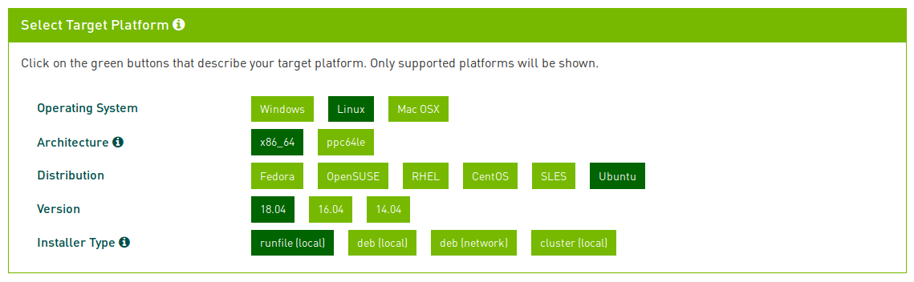

Title: LinuxMint-18 + GE62VR + GTX1060 + CUDA
Date: 2017-02-21 19:00
Category: Blog
Tag: linux, gpu, nvidia, cuda
Slug: ge62vr-mint-gtx1060
Author: Raymundo Cassani

\[Updated:\] Updated to Mint 19 (based in Ubuntu 18.0), NVIDIA driver xxx and CUDA driver xxxx

There are several posts with instructions for properly installing **NVIDIA drivers in Linux**. Unfortunately, sometimes they're outdated, moreover it's not possible to cover the immensity of system configurations. After searching and reading some of that information, I came down to this guide for my system (**Mint18** in **MSI-GE62VR**)`*`. The guide consists of two parts:

1. Install NVIDIA drivers
2. Install and test CUDA drivers.

`* Similar steps should apply for other dual monitor setups in Ubuntu and Ubuntu-based distributions.`

## System: [MSI GE62VR](https://www.msi.com/Laptop/GE62VR-6RF-Apache-Pro.html)
#### Operative System
* [Linux Mint 18](https://www.linuxmint.com/) 64-bit (Cinnamon)

#### Hardware
* [NVIDIA GTX 1060](https://www.nvidia.com/en-us/geforce/products/10series/laptops/#specs)
* [Intel HD Graphics 530 (integrated GPU)](https://en.wikipedia.org/wiki/Intel_HD_and_Iris_Graphics#Skylake)

## 1 Install NVIDIA driver

If the laptop's screen and external screen are working properly go to the CUDA section.

It seems that common problems at installing NVIDIA drivers in Mint (and Ubuntu) are: the laptop's monitor is disabled when a external monitor is connected; or Cinnamon crashes in "fallback mode" when the system boots without external the monitor.

So far the solution that worked for me, is to change to **Nouveau** drivers, purge any **NVIDIA** remaining and perform a clean **NVIDIA** installation

* Open the **Driver Manager**, and verify that the utilized drivers are the **Nouveau display driver** (change, and apply changes if necessary). Reboot your system.

* Once in **Nouveau** driver, purge the **NVIDIA** drivers

		:::bash
		$ sudo apt-get purge nvidia*
		$ sudo apt-get update
		$ sudo apt-get upgrade

* Unplug the **DigitalDisplay** adapter

* **Updated**: Add thefollowing repository to find the most recent drivers

		:::bash
        $ sudo add-apt-repository ppa:graphics-drivers/ppa

* Open the **Driver Manager** select the recommended **NVIDIA binary driver**  (nvidia-367 at 08/feb/2017)

* Restart your system

* The system should boot using the laptop's monitor as normally

* Connect the external monitor with the **DigitalDisplay** adapter

* Open **Display** to configure the position and behaviour of the monitors

* Open **NVDIA X Server Settings** to configure the external monitor

* **Updated** It works fine but prime-select cannot turn off the NVIDIA GPU, thus changing to the iGPU does not save power
* **Updated** Solution:

After installing, disable the “nvidia-fallback” service:

        :::bash        
        $ sudo systemctl disable nvidia-fallback.service

Blacklist nouveau driver using GRUB config. In /etc/default/grub look for a line `GRUB_CMDLINE_LINUX` . Add `nouveau.blacklist=1` into that parameter. If the line is not present add this line `GRUB_CMDLINE_LINUX="nouveau.blacklist=1"`

The third optional step is bbswitch (only for laptop users interested for power savings, if your system supports it.) Install “bbswitch-dkms”

`sudo apt install bbswitch-dkms`

Configure the system to load it by appending `bbswitch` in `/etc/modules`

To switch to Intel graphics run

`sudo prime-select intel`

To use NVIDIA (for external display etc)

`sudo prime-select nvidia`

## 2 Install and Test CUDA driver
Once the **NVIDIA driver** are properly installed, it's time to install the **CUDA driver**. If you're not sure what's the CUDA driver check this [link](http://www.nvidia.com/object/cuda_home_new.html)

* Download the [**CUDA driver**](https://developer.nvidia.com/cuda-downloads)

   

* Change the downloaded file to executable and execute it

		:::bash
		$ chmod +x cuda_8.0.61_375.26_linux.run
		$ sudo sh cuda_8.0.61_375.26_linux.run --override

* Installation parameters. Select **NO** when the CUDA installer ask to install **NVIDIA Accelerated Graphics Driver for Linux** as the NVIDIA driver is already installed.

		:::bash
		Do you accept the previously read EULA?
		accept/decline/quit: accept     

		You are attempting to install on an unsupported configuration. Do you wish to continue?
		(y)es/(n)o [ default is no ]: y

		Install NVIDIA Accelerated Graphics Driver for Linux-x86_64 375.26?
		(y)es/(n)o/(q)uit: n

		Install the CUDA 8.0 Toolkit?
		(y)es/(n)o/(q)uit: y

		Enter Toolkit Location
 		[ default is /usr/local/cuda-8.0 ]:

		Do you want to install a symbolic link at /usr/local/cuda?
		(y)es/(n)o/(q)uit: y

		Install the CUDA 8.0 Samples?
		(y)es/(n)o/(q)uit: y

		Enter CUDA Samples Location
 		[ default is /home/cassani ]: /usr/local/cuda-8.0

		Installing the CUDA Toolkit in /usr/local/cuda-8.0 ...
		Missing recommended library: libGLU.so
		Missing recommended library: libX11.so
		Missing recommended library: libXi.so
		Missing recommended library: libXmu.so

		Installing the CUDA Samples in /usr/local/cuda-8.0 ...
		Copying samples to /usr/local/cuda-8.0/NVIDIA_CUDA-8.0_Samples now...
		Finished copying samples.

* Prepare the CUDA environment by adding the following 3 lines to your `.bashrc` file

		:::bash
		export CUDA_HOME=/usr/local/cuda    
		export LD_LIBRARY_PATH=/usr/local/cuda/lib64:$LD_LIBRARY_PATH
		export PATH=/usr/local/cuda/bin:$PATH

* And source it

		:::bash
		$ source ~/.bashrc

<!---
An alternavive for CUDA environment is:
Create the file `/etc/profile.d/cuda.sh` with the line
export PATH=$PATH:/usr/local/cuda/bin
Create the file `/etc/ld.so.conf.d/cuda.conf` with the line
/usr/local/cuda/lib64
$ sudo ldconfig
-->

* Verify Cuda Compiler driver

		:::bash
		$ nvcc --version

		nvcc: NVIDIA (R) Cuda compiler driver
		Copyright (c) 2005-2016 NVIDIA Corporation
		Built on Tue_Jan_10_13:22:03_CST_2017
		Cuda compilation tools, release 8.0, V8.0.61

* Install g++ (If you haven't)

		:::bash
		$ sudo apt-get install g++
		$ sudo apt-get install build-essential
		$ sudo apt-get install make

* **(Optional)** Install additional libraries to be able to build most of the samples:

		:::bash
		$ sudo apt-get install freeglut3-dev build-essential libx11-dev libxmu-dev libxi-dev libgl1-mesa-glx libglu1-mesa libglu1-mesa-dev

 
**Building the samples**

 Several of the samples require **GL libraries**, to find the correct path for those libraries, the file `fingllib.mk` is used. As **Linux Mint** is not an officially supported distribution a slight change is necessary in the `fingllib.mk` file. To avoid editing all instances of this file, its multiple copies will be replaced with a symbolic link.

* Go to `/common` folder in the samples path

		:::bash
		$ cd /usr/local/cuda/samples/common

* Open `fingllib.mk` and, in the line 62 change `ubuntu` for `'ubuntu\|linuxmint'`  

	**Do not forget the simple quotes**

* Search for all the instances of `fingllib.mk` outside of `/common` and replace them with a symbolic link to `usr/local/cuda/samples/common/fingllib.mk`.

		:::bash
		$ cd /usr/local/cuda/samples/common
		$ sudo find .. ! -path "*/common*" -name findgllib.mk -exec ln -sf /usr/local/cuda/samples/common/findgllib.mk {} ';'

* Run the commnad `make` while in the samples path

		:::bash
		$ cd /usr/local/cuda/samples
		$ sudo make

**Running the sample binaries**

* Go to the sample binaries folder

		:::bash
		$ cd /usr/local/cuda/samples/bin/x86_64/linux/release

* Verify that your CUDA Capable device is found

		:::bash
		$ ./deviceQuery

		./deviceQuery Starting...

 		CUDA Device Query (Runtime API) version (CUDART static linking)

		Detected 1 CUDA Capable device(s)

		Device 0: "GeForce GTX 1060"
  		CUDA Driver Version / Runtime Version          8.0 / 8.0
  		CUDA Capability Major/Minor version number:    6.1
  		...

* Sample `fluidsGL`

		:::bash
		$ ./fluidsGL

	

	
	   
	

###References

[http://blog.csdn.net/kernlen/article/details/53882490](http://blog.csdn.net/kernlen/article/details/53882490)

[http://blog.csdn.net/wopawn/article/details/52302164](http://blog.csdn.net/wopawn/article/details/52302164)

[http://blog.csdn.net/lee_j_r/article/details/52693724](http://blog.csdn.net/lee_j_r/article/details/52693724)

[http://www.voidcn.com/blog/u010696366/article/p-3712151.html](http://www.voidcn.com/blog/u010696366/article/p-3712151.html)

[http://stackoverflow.com/questions/34617236/cuda-missing-libgl-so-libglu-so-and-libx11-so](http://stackoverflow.com/questions/34617236/cuda-missing-libgl-so-libglu-so-and-libx11-so)

[https://www.pugetsystems.com/labs/hpc/NVIDIA-CUDA-with-Ubuntu-16-04-beta-on-a-laptop-if-you-just-cannot-wait-775/](https://www.pugetsystems.com/labs/hpc/NVIDIA-CUDA-with-Ubuntu-16-04-beta-on-a-laptop-if-you-just-cannot-wait-775/)

[http://docs.nvidia.com/cuda/cuda-installation-guide-linux/#axzz4Y9Whzcjf](http://docs.nvidia.com/cuda/cuda-installation-guide-linux/#axzz4Y9Whzcjf)

[https://devtalk.nvidia.com/default/topic/936429/-solved-tensorflow-with-gpu-in-anaconda-env-ubuntu-16-04-cuda-7-5-cudnn-/](https://devtalk.nvidia.com/default/topic/936429/-solved-tensorflow-with-gpu-in-anaconda-env-ubuntu-16-04-cuda-7-5-cudnn-/)

[http://developer.download.nvidia.com/compute/cuda/6_5/rel/docs/CUDA_Getting_Started_Linux.pdf](http://developer.download.nvidia.com/compute/cuda/6_5/rel/docs/CUDA_Getting_Started_Linux.pdf)

[https://forums.linuxmint.com/viewtopic.php?t=226145](https://forums.linuxmint.com/viewtopic.php?t=226145)

[https://medium.com/@agathver/nvidia-gpu-optimus-prime-and-ubuntu-18-04-woes-f52e7f850f3d](https://medium.com/@agathver/nvidia-gpu-optimus-prime-and-ubuntu-18-04-woes-f52e7f850f3d)
<!--
Code for button
<a class="btn btn-primary" href="#">Booton</a>
-->
