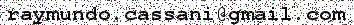

Title: About
Date: 2016-10-22
Category: Page
Slug: about-me
Author: Ray Cassani
Sortorder: 3

## Hello,

My name is **Raymundo Cassani**, (Ray works perfectly for me). Currently, I'm a PhD candidate in Montréal, Canada. While my academic background is in electrical engineering, specifically telecommunications and electronics. I'm a person who finds enjoyment in repairing and / or modifying stuff. I love to learn a bit of everything, my bet is that a bit of everything more better that everything of a bit. Some of my interests are data visualization, maps, beavers, videogames, science fiction, karate, etc.

The principal goal of this blog, is:

* Share some of my work and experiences, walkthroughs, dilemmas or solutions to problems (with software, hardware, methods, etc.) I've encountered and expended a significant amount of time on them; hopefully this may serve as timesaver and inspiration to others (including a future-me).

Hope you enjoy it as much as I enjoy to write on it.
 
 
 

## **Why CastorisCausa.com?**
 
From Latin **Castoris** (or related to the beaver) and **Causa** (cause), then roughly:  
 **"For the sake of the beaver"**.  
 <!--  -->

  

 

The beaver, its nature and behavior have always evoked my admiration and sympathy; being a semi-aquatic animal, it gets the best of two worlds. The beaver is the vivid description of hard work, dexterity and ingenuity. Not surprisingly, it has been taken as mascot by several engineering schools around the world.

<!--
How they are capable of modifying the landscape. Represent an mix of things, which is my goal and objective, as a electrical engineer and apply my knowledge to other fields.
-->

Feedback, suggestions, complains, leave a comment in the respective post or drop me a line:

  

